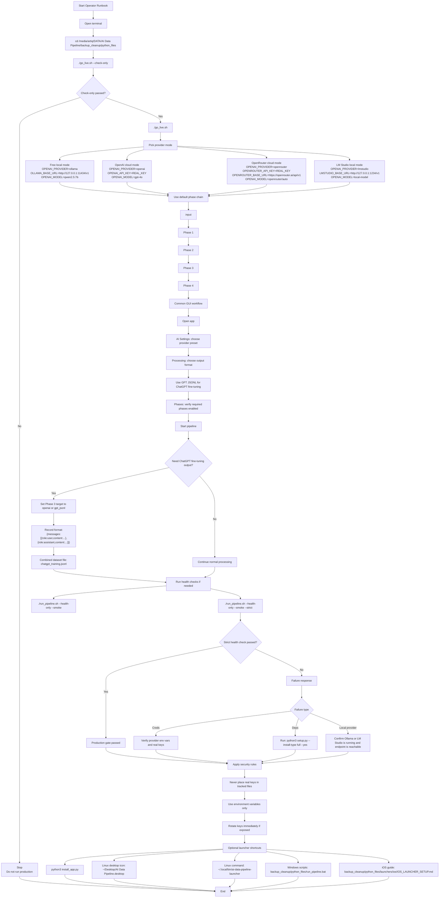

# AI Data Pipeline

A production-ready desktop application for transforming raw documents into high-quality, model-specific training data for large language models.

## What Does This Do?

AI Data Pipeline takes your raw documents (PDF, CSV, JSON, TXT, Markdown) and converts them into formatted training data ready for fine-tuning AI models. Think of it as a "data cleaning and formatting factory" - you feed it messy documents, and it outputs clean, properly formatted training examples.

### Use Cases

| Use Case | Description |
|----------|-------------|
| **Fine-tune ChatGPT** | Convert documents into OpenAI's JSONL format for ChatGPT fine-tuning |
| **Train Custom Models** | Create training data for Llama, Qwen, Mistral, and other open models |
| **Add Personality** | Apply consistent tone and personality to your training data |
| **Data Cleaning** | Sanitize documents by removing malware, fixing encoding, normalizing text |

### The Pipeline Flow

```
Raw Documents → Phase 1 (Sanitize/Clean) → Phase 2 (Chunk) → Phase 3 (Personality + Format) → Phase 4 (Quality Check) → Training Data
```



---

## Installation

### Prerequisites

- Python 3.10 or higher
- 4GB RAM minimum (8GB recommended)
- Optional: API key for OpenAI/OpenRouter (not required for local models)

### Quick Install (Linux/macOS)

```bash
cd /path/to/AI-Data-Pipeline/backup_cleanup/python_files
python3 setup.py --install-type full --yes
```

This single command will:
1. Create a virtual environment
2. Install all dependencies
3. Create desktop launcher and app menu shortcuts

### Launch the Application

After installation, you have several options:

```bash
# Option 1: Use the desktop launcher (if created)
# Double-click "AI Data Pipeline" on your desktop

# Option 2: Use command line
~/.local/bin/ai-data-pipeline-launcher

# Option 3: Run directly
cd /path/to/AI-Data-Pipeline/backup_cleanup/python_files
./go_live.sh
```
---
**Gist RUNBOOK.md (also in root)**
[Gist Runbook and Operation Guide](https://gist.github.com/IceMasterT/281c0f2e008d25d21d3798b07fefb0f9)
---

## Quick Start Guide

### Step 1: Select Your Files

1. Launch the application
2. Go to the **Main Control** tab
3. Click **Browse** to select your input folder containing PDF, CSV, JSON, TXT, or MD files
4. Click **Scan Files** to see what was found

### Step 2: Choose Output Format

1. Go to the **Processing** tab
2. Select your target format:
   - **Qwen** - For Qwen models
   - **Alpaca** - For Alpaca-style training
   - **ChatML** - For ChatML-based models
   - **Llama2** - For Llama 2 models
   - **GPT JSONL** - For ChatGPT fine-tuning
   - **ShareGPT** - For ShareGPT format

### Step 3: Configure AI (Optional)

If you want AI-powered features (personality injection, content enhancement):

1. Go to the **AI Settings** tab
2. Choose your provider:
   - **OpenAI** - Uses GPT-4o (requires API key)
   - **OpenRouter** - Access multiple models through one API
   - **LM Studio** - Run models locally on your computer
   - **Ollama** - Free local inference (no API key needed)
3. Set your daily cost limit (default: $15/day)

### Step 4: Set Personality (Optional)

To add a consistent personality or tone to your training data:

1. Go to the **Personality** tab
2. Enable "Personality Modifier"
3. Choose a profile: Professional, Casual, Technical, Creative, Friendly, Formal, Humorous, Educational, or Conversational
4. Adjust the **Strength** slider (0.1 = subtle, 1.0 = strong transformation)

### Step 5: Run the Pipeline

1. Go to the **Main Control** tab
2. Click **🚀 START PIPELINE**
3. Watch progress in the status bar and Monitoring tab

---

## GUI Tab Reference

The application has 9 tabs, each serving a specific purpose:

### 🚀 Main Control Tab

The command center for running your pipeline.

| Setting | Description |
|---------|-------------|
| **Input Folder** | Location of your raw documents (PDF, CSV, JSON, TXT, MD) |
| **Files to Process** | List of detected files ready for processing |
| **START PIPELINE** | Begins the full pipeline execution |
| **Pause/Resume** | Temporarily stop or continue processing |
| **Abort** | Cancel processing entirely |
| **Save Config** | Save current settings for future use |
| **View Results** | Open the output folder with processed files |
| **Progress Bar** | Visual indicator of overall pipeline progress |

### 🎛️ Phase Control Tab

Fine-grained control over each processing stage.

| Phase | Description |
|-------|-------------|
| **Phase 1: Sanitization** | Cleans text: removes malware, fixes encoding, normalizes Unicode, removes invisible characters |
| **Phase 2: Chunking** | Splits large documents into manageable pieces |
| **Phase 3: Personality** | Applies tone/personality transformation and formats for target model |
| **Phase 4: Quality** | Validates output quality, scores examples, filters low-quality content |

Each phase can be **enabled/disabled** individually using the Toggle button. Click the ⚙️ button to configure phase-specific settings.

### 🤖 AI Settings Tab

Configure AI providers and cost controls.

| Setting | Description |
|---------|-------------|
| **Provider** | AI service to use: OpenAI, OpenRouter, LM Studio, or Ollama |
| **API Key** | Your authentication key (hidden by default, click "Show" to reveal) |
| **Provider Endpoint** | Custom API URL (auto-filled based on provider) |
| **Model** | Specific model to use (e.g., gpt-4o, llama3.1:8b, qwen2.5:7b) |
| **Daily Cost Limit** | Maximum spending per day (set to $0 for free local models) |
| **Provider Presets** | One-click configuration buttons for each provider |
| **Free Cost Mode** | Uses Ollama + qwen2.5:7b (completely free, runs locally) |
| **Enable AI Classification** | Use AI to categorize content during processing |
| **Enable Content Enhancement** | Use AI to improve content quality |

### 🎭 Personality Tab

Control the tone and style of your training data.

| Setting | Description |
|---------|-------------|
| **Enable Personality Modifier** | Turn personality transformation on/off |
| **Profile** | Pre-defined personality templates:
  - *Neutral* - No transformation
  - *Casual* - Conversational, relaxed tone
  - *Professional* - Formal, business-appropriate
  - *Technical* - Precise, technical language
  - *Creative* - Imaginative, varied expression
  - *Friendly* - Warm, approachable
  - *Formal* - Traditional, respectful
  - *Humorous* - Light, witty tone
  - *Educational* - Clear, instructive
  - *Conversational* - Natural dialogue style |
| **Strength** | How strongly to apply the personality (0.1 = subtle, 1.0 = strong) |
| **Custom Personality** | Write your own personality description for unique tone requirements |

### 🛡️ Security Tab

Data validation and sanitization options.

| Setting | Description |
|---------|-------------|
| **Enable Security Filtering** | Turn security checks on/off |
| **Security Level** | 
  - *Strict* - Maximum filtering, catches everything suspicious
  - *Balanced* - Recommended level
  - *Permissive* - Minimal filtering |
| **Security Features** | Individual toggles for:
  - Unicode Normalization
  - Invisible Character Removal
  - RTL/LTR Override Detection
  - Entropy Analysis (detects encrypted/hidden content)
  - Homoglyph Detection (lookalike character attacks)
  - Malformed Markup Validation |
| **Security Logs** | View all security events and actions taken |

### 📁 Folders Tab

Manage where files are stored at each stage.

| Setting | Description |
|---------|-------------|
| **Input Folder** | Original raw documents |
| **Phase 1 Output** | Cleaned/sanitized files |
| **Phase 2 Output** | Chunked files |
| **Phase 3 Output** | Personality-transformed files |
| **Phase 4 Output** | Final quality-checked files (your training data) |

The pipeline automatically passes files from one folder to the next. Click **Refresh Status** to see file counts and folder sizes.

### ⚙️ Processing Tab

Configure output format and performance settings.

| Setting | Description |
|---------|-------------|
| **Output Format** | Target model format (Qwen, Alpaca, ChatML, Llama2, ShareGPT, GPT JSONL) |
| **Parallel Workers** | Number of files to process simultaneously (1-8, default: 4) |
| **Batch Size** | Documents processed per AI batch (1-50, default: 10) |

### 📊 Monitoring Tab

Real-time visibility into pipeline operation.

| Tab | Description |
|-----|-------------|
| **Real-time Logs** | Live scroll of all pipeline events |
| **Phase Results** | Summary of each phase's output |
| **System Status** | Memory, CPU, and system information |
| **Statistics** | Files processed, time elapsed, costs incurred |

### 🏛️ Ten Pillars Tab (Advanced)

Enterprise-grade quality enforcement system.

| Feature | Description |
|---------|-------------|
| **Data Contract Validation** | Ensures output meets strict schema requirements |
| **Multi-layer Filtering** | Progressive quality gates |
| **Disciplined Prompting** | Consistent AI prompt templates |
| **Uniform Formatting** | Standardized output structure |
| **Iterative Quality Scoring** | Multiple passes to ensure quality |
| **Enhanced Accuracy** | 95% accuracy target enforcement |
| **Strict Prompting** | Tight prompt control for consistency |

---

## Supported File Formats

### Input Formats
- PDF (`.pdf`)
- CSV (`.csv`)
- JSON (`.json`)
- JSONL (`.jsonl`)
- Plain text (`.txt`)
- Markdown (`.md`)

### Output Formats

| Format | Use Case | Example |
|--------|----------|---------|
| **Qwen** | Qwen model fine-tuning | `<\|user\|>prompt<\|assistant\|>response` |
| **Alpaca** | Alpaca-style training | `### Instruction\n...\n### Response\n...` |
| **ChatML** | ChatML-based models | `<\|im_start\|>user\n...<\|im_end\|>` |
| **Llama2** | Llama 2 fine-tuning | `[INST]prompt[/INST] response` |
| **ShareGPT** | ShareGPT datasets | `{"conversations": [...]}` |
| **GPT JSONL** | ChatGPT fine-tuning | `{"messages":[{"role":"user","content":"..."}...]}` |

---

## API Configuration

### Environment Variables

Set these before running (or configure in the GUI):

```bash
# OpenAI
export OPENAI_PROVIDER=openai
export OPENAI_API_KEY="your-key-here"
export OPENAI_MODEL="gpt-4o"

# OpenRouter (multiple models, one key)
export OPENAI_PROVIDER=openrouter
export OPENROUTER_API_KEY="your-key-here"
export OPENAI_MODEL="openrouter/auto"

# LM Studio (local, no key)
export OPENAI_PROVIDER=lmstudio
export LMSTUDIO_BASE_URL="http://127.0.0.1:1234/v1"

# Ollama (local, no key)
export OPENAI_PROVIDER=ollama
export OLLAMA_BASE_URL="http://127.0.0.1:11434/v1"
export OPENAI_MODEL="qwen2.5:7b"
```

---

## Troubleshooting

### Common Issues

| Problem | Solution |
|---------|----------|
| GUI won't start | Run `./go_live.sh` from terminal to see error messages |
| API key not working | Ensure environment variable is set, or enter in GUI AI Settings tab |
| Local model won't connect | Make sure LM Studio or Ollama is running before starting pipeline |
| Out of memory | Reduce "Parallel Workers" in Processing tab to 1-2 |
| Files not processing | Check input folder contains valid file types (PDF, CSV, JSON, TXT, MD) |

### Getting Help

1. Check the **Monitoring** tab for detailed error messages
2. Review **Security Logs** in the Security tab
3. Run with reduced parallelism to see clearer error output

---

## License

MIT License with Commons Clause

Copyright (c) 2024

---

## Acknowledgments

Built with Python, Tkinter, OpenAI SDK, and contributions from the open-source community.
